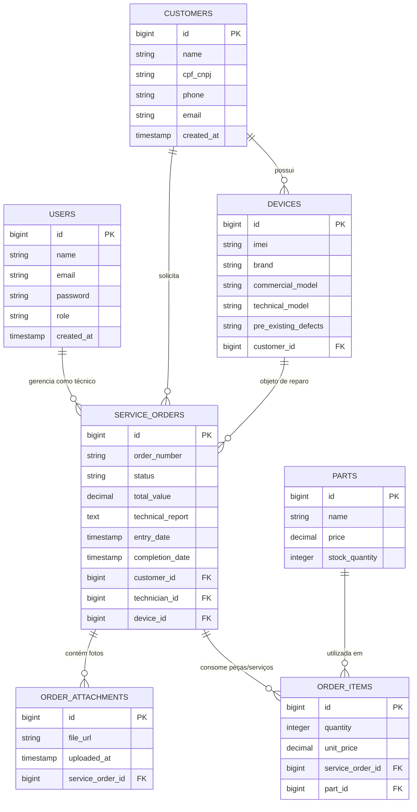

# Modelo de Banco de Dados (ERD) - FixFlow

## 1. Diagrama Entidade-Relacionamento (Mermaid)

---

## 2. Dicionário de Tabelas

### **2.1. `tb_users` (Usuários do Sistema)**
| Coluna | Tipo | Restrições | Descrição |
| :--- | :--- | :--- | :--- |
| `id` | BIGINT | PK, Auto-increment | Identificador único. |
| `name` | VARCHAR(100) | NOT NULL | Nome completo. |
| `email` | VARCHAR(100) | UNIQUE, NOT NULL | Login e e-mail do usuário. |
| `password` | VARCHAR(255) | NOT NULL | Hash da senha (BCrypt). |
| `role` | VARCHAR(20) | NOT NULL | Papel no sistema (`ROLE_ADMIN`, `ROLE_TECNICO`). |
| `created_at` | TIMESTAMP | DEFAULT NOW() | Data de cadastro. |

### **2.2. `tb_customers` (Clientes)**
| Coluna | Tipo | Restrições | Descrição |
| :--- | :--- | :--- | :--- |
| `id` | BIGINT | PK, Auto-increment | Identificador único do cliente. |
| `name` | VARCHAR(100) | NOT NULL | Nome do cliente. |
| `cpf_cnpj` | VARCHAR(20) | UNIQUE, NOT NULL | Documento fiscal (usado para consulta do status). |
| `phone` | VARCHAR(20) | NOT NULL | Telefone / WhatsApp. |
| `email` | VARCHAR(100) | NULLABLE | E-mail do cliente. |

### **2.3. `tb_devices` (Aparelhos / Equipamentos)**
| Coluna | Tipo | Restrições | Descrição |
| :--- | :--- | :--- | :--- |
| `id` | BIGINT | PK, Auto-increment | Identificador do dispositivo. |
| `imei` | VARCHAR(30) | NULLABLE | IMEI (usado na API de busca externa). |
| `brand` | VARCHAR(50) | NOT NULL | Marca (ex: Samsung, Apple). |
| `commercial_model` | VARCHAR(100) | NOT NULL | Modelo comercial (ex: Galaxy S23). |
| `technical_model` | VARCHAR(100) | NULLABLE | Modelo técnico (ex: SM-S918B). |
| `pre_existing_defects`| TEXT | NULLABLE | Avarias de entrada (ex: tela trincada). |
| `customer_id` | BIGINT | FK (`tb_customers`) | Dono do aparelho. |

### **2.4. `tb_service_orders` (Ordens de Serviço)**
| Coluna | Tipo | Restrições | Descrição |
| :--- | :--- | :--- | :--- |
| `id` | BIGINT | PK, Auto-increment | Identificador interno da O.S. |
| `order_number` | VARCHAR(20) | UNIQUE, NOT NULL | Código público de rastreio (ex: OS-2026-0001). |
| `status` | VARCHAR(30) | NOT NULL | Status do fluxo da O.S. |
| `total_value` | DECIMAL(10,2)| DEFAULT 0.00 | Valor total do serviço. |
| `technical_report` | TEXT | NULLABLE | Laudo técnico do reparo. |
| `entry_date` | TIMESTAMP | DEFAULT NOW() | Data de entrada do equipamento. |
| `completion_date` | TIMESTAMP | NULLABLE | Data de conclusão ou retirada. |
| `customer_id` | BIGINT | FK (`tb_customers`) | Cliente vinculado. |
| `technician_id` | BIGINT | FK (`tb_users`) | Técnico responsável. |
| `device_id` | BIGINT | FK (`tb_devices`) | Aparelho associado. |

### **2.5. `tb_order_attachments` (Fotos e Evidências)**
| Coluna | Tipo | Restrições | Descrição |
| :--- | :--- | :--- | :--- |
| `id` | BIGINT | PK, Auto-increment | Identificador do anexo. |
| `file_url` | VARCHAR(255) | NOT NULL | Caminho da imagem salva no servidor/S3. |
| `service_order_id` | BIGINT | FK (`tb_service_orders`) | O.S. vinculada. |

### **2.6. `tb_parts` (Peças e Mão de Obra)**
| Coluna | Tipo | Restrições | Descrição |
| :--- | :--- | :--- | :--- |
| `id` | BIGINT | PK, Auto-increment | Identificador do item. |
| `name` | VARCHAR(100) | NOT NULL | Nome da peça ou serviço. |
| `price` | DECIMAL(10,2)| NOT NULL | Preço unitário. |
| `stock_quantity` | INTEGER | DEFAULT 0 | Estoque disponível. |

### **2.7. `tb_order_items` (Itens Aplicados na O.S.)**
| Coluna | Tipo | Restrições | Descrição |
| :--- | :--- | :--- | :--- |
| `id` | BIGINT | PK, Auto-increment | Identificador do registro. |
| `quantity` | INTEGER | NOT NULL | Quantidade utilizada. |
| `unit_price` | DECIMAL(10,2)| NOT NULL | Valor unitário no momento do orçamento. |
| `service_order_id` | BIGINT | FK (`tb_service_orders`) | O.S. vinculada. |
| `part_id` | BIGINT | FK (`tb_parts`) | Peça associada. |